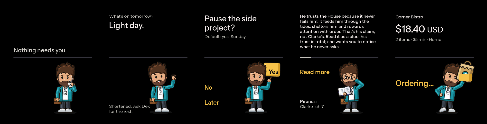
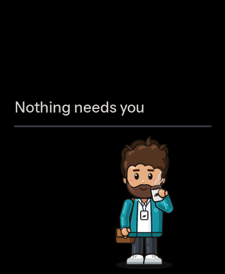
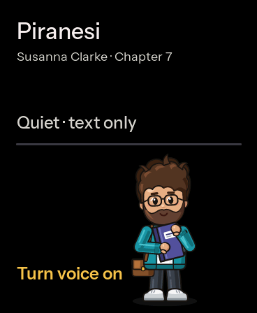
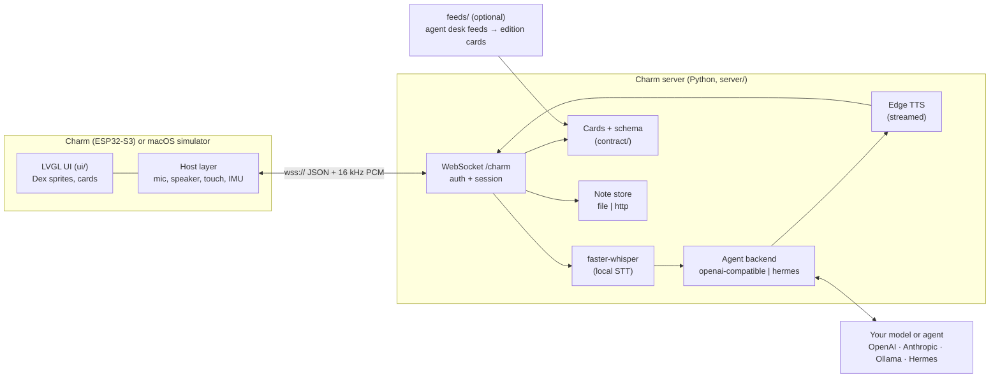

# Dex Charm

**A pocket AMOLED charm with a living character on it. Hold to talk to your AI agent; glance at
what's waiting; hold to say yes.**



Dex Charm is an ESP32-S3 with a 1.8" AMOLED screen, a mic and a speaker. An always-animated
character, Dex, lives on it. You hold the button and ask; a small Python server transcribes you
(faster-whisper), asks your agent, and answers with a short card on screen and two spoken
sentences (Edge TTS). The agent can be **any OpenAI-compatible model** (OpenAI, Anthropic's
OpenAI-compatible endpoint, a local Ollama or LM Studio) or a
[Hermes](https://github.com/NousResearch/hermes-agent) agent you already run.

It's not a new assistant squeezed into a gadget. It's a **remote and a face** for an agent you
already trust, built on one rule: **the screen never lies.**

<table>
<tr>
<td align="center"><br><sub>Idle: breathing, blinks, the odd sip</sub></td>
<td align="center"><br><sub>Talk, decide, hold to pay</sub></td>
<td align="center"><br><sub>Reading mode</sub></td>
<td align="center"><br><sub>A second character</sub></td>
</tr>
</table>

## Features

- **Hold to talk**, in English or Spanish. Answers stream: Dex starts speaking on the first
  sentence while the rest is still being written.
- **Honest states.** "Listening" only while the mic is actually capturing. ✓, Done and Saved only
  after the backend confirms. Stale data says it's stale. Offline is shown, never hidden.
- **Cards you decide on**: approve / reject / later, with a stated default and deadline. Money
  only with a **2-second hold of Dex's bag** on a preview, never a tap.
- **Reading mode**: tell Dex which book and chapter you're on, then ask about it with **no spoilers
  past your chapter** and no invented quotes. Answers are a short lead plus a scrollable detail.
- **"Save this: …"** stores your words **verbatim** (one Markdown file per note by default).
- **The pocket edition**: a six-card morning paper built from your agent's feeds.
- **A second character**: Coach Beard, a fantasy-football coach with his own body, voice and
  history. He's the worked example of adding agents.
- **Runs without hardware**: the same LVGL UI code builds into a macOS simulator.

## How it fits together



One WebSocket carries JSON text frames and raw 16 kHz mono PCM in both directions. The full
contract is [`docs/PROTOCOL.md`](docs/PROTOCOL.md), with a JSON Schema for every card kind in
[`contract/`](contract/).

## Hardware

| Part | Notes |
|---|---|
| **[Waveshare ESP32-S3-Touch-AMOLED-1.8](https://www.waveshare.com/esp32-s3-touch-amoled-1.8.htm), V2** | 368×448 AMOLED (CO5300), capacitive touch (CST820), ES8311 codec with mic and speaker, QMI8658 IMU, AXP2101 power management, 16 MB flash, 8 MB PSRAM. **V2 only**: V1 uses different display and touch chips. Roughly US$25–35; check the current price. |
| USB-C cable | For flashing and power. |
| 3.7 V LiPo (optional) | The board charges and reads a battery through the AXP2101. The charm reports a level only when a battery is actually attached. Check the connector on your board revision before buying one. |

The server and the simulator run on a Mac or a Linux box.

## Quickstart without hardware (macOS)

You need [uv](https://docs.astral.sh/uv/), `cmake`, `ffmpeg` and SDL2 (`brew install uv cmake
ffmpeg sdl2`), plus an agent endpoint. The commands below were run to test this README, against a
local [Ollama](https://ollama.com) model; swap in any OpenAI-compatible endpoint.

**1. Build and test the simulator**

```sh
git clone https://github.com/<you>/dex-charm && cd dex-charm
cmake -S sim -B build/sim && cmake --build build/sim -j 8
ctest --test-dir build/sim --output-on-failure
./build/sim/charm-sim --shots out/shots          # every screen as a PNG
./build/sim/charm-sim                            # a window; press h for the keys
```

**2. Run the server with your model**

```sh
cd server
cp .env.example .env            # set CHARM_TOKEN (any long random string)
uv sync
# a local model (after `ollama pull qwen3:14b`), no API key:
CHARM_AGENT_BASE_URL=http://127.0.0.1:11434/v1 CHARM_AGENT_MODEL=qwen3:14b uv run charm-server
# or OpenAI:    CHARM_AGENT_API_KEY=sk-… CHARM_AGENT_MODEL=<model> uv run charm-server
# or Anthropic: CHARM_AGENT_BASE_URL=https://api.anthropic.com/v1/ CHARM_AGENT_API_KEY=… \
#               CHARM_AGENT_MODEL=<claude model id> uv run charm-server
```

**3. Talk to it**

```sh
# a fake device in the terminal (macOS `say` speaks the question):
cd server
uv run charm-client --say "What is the difference between a metaphor and a simile?"
uv run charm-client --say "Save this: foxes know many small things"   # → server/.local/notes/

# or the simulator as the device (hold SPACE to talk), from the repo root:
CHARM_TOKEN=<your token> ./build/sim/charm-sim --connect ws://127.0.0.1:8765/charm
```

`scripts/demo.sh` starts the server and the connected simulator in one command, reading
`server/.env`. Every setting is in [`server/.env.example`](server/.env.example) and
[`server/README.md`](server/README.md). For example, `CHARM_OWNER_NAME` puts your name in the
prompts, `CHARM_TZ` sets the clock, `CHARM_VOICE_*` picks the Edge voices, and `COACH_ENABLED=1`
adds the second character.

## Flash the charm

```sh
cd firmware
cp src/secrets.example.h src/secrets.h     # gitignored: Wi-Fi, server host/port, CHARM_TOKEN
pio run -e charm                            # PlatformIO; the first run downloads the toolchain (~1 GB)
pio test -e native                          # unit tests for the pure logic, on your computer
pio run -e charm -t upload --upload-port /dev/cu.usbmodemXXXX
pio device monitor -b 115200                # expect: [charm] touch=1 audio=1 imu=1 pmu=1 psram=8388608
```

Back up the factory flash first ([`firmware/README.md`](firmware/README.md) → Flash), then work
through [`firmware/HARDWARE-TEST.md`](firmware/HARDWARE-TEST.md).

- **On your LAN:** set `CHARM_SERVER_TLS 0`, point `CHARM_SERVER_HOST` at your computer, and run
  the server with `--host 0.0.0.0`.
- **Away from home:** the charm connects with **`wss://`**, verified against the Let's Encrypt roots
  in `firmware/src/ca_roots.h`. Set `CHARM_SERVER_TLS 1` and a public hostname.

The BOOT button is hold-to-talk, with a 25 s limit.

## Deploy the server

[`deploy/vps/`](deploy/vps/) has a Dockerfile and a compose file for any Linux host, with Whisper
baked into the image. Keep the container on a private address and put a TLS endpoint in front of
it: a **Tailscale Funnel** (no open ports, no domain) or any reverse proxy with a Let's Encrypt
certificate (a Caddy example is included). The `CHARM_TOKEN` is what stands between the internet
and your agent, so make it long and random.

## Make your own character

Dex is drawn in code, not by hand. The poses live in
[`docs/design/final/src/`](docs/design/final/src/) (`dex.py` has the parts, `sheet.py` the poses),
and the asset tool renders them to frames and compiles those to LZ4 RGB565 C arrays:

```sh
cd tools
uv run charm-assets export-dex                                   # design source → ui/assets-src/dex/
uv run charm-assets sprites ../ui/assets-src/dex/manifest.json   # → ui/charm_assets_sprites.*
uv run charm-assets budget ../ui/assets-src/dex/manifest.json    # flash budget
```

A new character can replace Dex without a UI redesign if it meets the **character-swap contract**
([`docs/BRIEF.md` § 11.7](docs/BRIEF.md)):

1. **The same pose list** (idle, listening, working, speaking, attention, done, error, the hold
   frames…) and the frame sets in [`motion.md`](docs/design/final/motion.md).
2. **The same style**: flat tonal steps, one outline weight, no gradients, plus a night palette.
3. **The same footprint**: a 192×224 cell, the hip at screen (236, 379), about 211 px tall, and
   never above y = 214 (the content zone).
4. **Hands**, or an equivalent that can hold the Yes sign, the bag and the paper.
5. **Colours that don't collide with the gold accent**, which means "you can act on this".

Coach Beard is the worked example. His design is in
[`docs/design/final/coach/`](docs/design/final/coach/), his export command is
`charm-assets export-coach` ([`tools/README.md`](tools/README.md) → Coach), and the server side is
the optional `COACH_*` settings ([`docs/COACH.md`](docs/COACH.md)).

### About Coach Beard

Coach Beard is the author's fantasy-football sub-agent. In the original setup he's a second agent
profile that researches the author's league and makes one start/sit call at a time, while Dex handles
everything else. He ships here as the worked example and stays off until you set `COACH_ENABLED=1`.
The NFL names in his fixtures and tests are sample data.

### Example: adding a second agent of your own

Say you want a cooking agent, **Chef**, next to Dex. Follow the path Coach took:

1. **Draw him** to the character-swap contract above, render his frames and compile them the way
   `charm-assets export-coach` does for Coach (`ui/assets-src/coach/` has the layout). On the device
   side, add `DEX_CHARACTER_CHEF` in [`ui/dex_sprite.h`](ui/dex_sprite.h) and `"chef"` in
   `CHARACTER_NAMES` in [`ui/dex_sprite.cpp`](ui/dex_sprite.cpp).
2. **Speak his name on the wire.** The server sends `state{…, agent:"chef"}` and
   `mode{…, agent:"chef"}`, and his cards carry `source:"chef"` ([`docs/PROTOCOL.md`](docs/PROTOCOL.md)
   § Agents). The device crossfades to his character on the anchor, as it does for Coach.
3. **Route to him.** In [`server/src/charm_server/routing.py`](server/src/charm_server/routing.py),
   add `"chef"` to `AGENTS` and a rule: a wake word ("Chef, …") and, if you like, a narrow topic
   test. Give him a persona appendix and a voice, the way `coach.py` and the `COACH_*` settings in
   `config.py` do.
4. **Watch the handover** in the simulator with a replay modelled on
   [`sim/replays/coach.jsonl`](sim/replays/coach.jsonl).

## Principles

- **Never fake listening.** The listening pose appears only while the mic is capturing.
- **Never fake done.** No ✓, "Done" or "Saved" before the backend confirms it.
- **Read, don't act.** A microphone can mishear, so the agent looks things up and answers but
  doesn't send, order, delete or schedule. It says what it would do and where to do it.
- **Money is a deliberate hold** of Dex's bag on a preview, never a tap. v0 never places a real
  order, and sample orders say so.
- **Stale data says it's stale.** Dex waits to be looked at; he never pings.
- **Your words stay yours.** "Save this" stores them verbatim; nothing is summarized or added.

## Project layout

| Path | What |
|---|---|
| [`docs/PROTOCOL.md`](docs/PROTOCOL.md), [`contract/`](contract/) | The wire protocol and the card JSON Schema (the contract) |
| [`docs/BRIEF.md`](docs/BRIEF.md), [`docs/design/`](docs/design/) | The product brief (§ 11 is the final design); `design/final/` has the reference renders and the pose source |
| [`ui/`](ui/) | The LVGL UI shared by the firmware and the simulator, plus the generated sprite and font assets |
| [`firmware/`](firmware/) | PlatformIO ESP32-S3 firmware (Arduino core) |
| [`sim/`](sim/) | The macOS SDL2 simulator, screenshot mode and contract tests (CMake) |
| [`server/`](server/) | The charm server: WebSocket, STT → agent → TTS, reading mode, Coach |
| [`notes/`](notes/) | The "save this" note-store contract and an HTTP store |
| [`feeds/`](feeds/) | Optional: an agent's desk feeds → the pocket-edition cards |
| [`tools/`](tools/) | `charm-assets`: sprites and fonts → C code |
| [`scripts/`](scripts/) | `demo.sh` (server + sim in one command) and the live integration test |
| [`deploy/vps/`](deploy/vps/) | Docker deploy and public-endpoint notes |

## Contributing

Issues and PRs are welcome; see [`CONTRIBUTING.md`](CONTRIBUTING.md). CI runs the Python suites,
the firmware build and native tests, and the simulator build and tests.

## License

[MIT](LICENSE). Bundled and fetched components keep their own licenses; see
[`THIRD_PARTY_NOTICES.md`](THIRD_PARTY_NOTICES.md). Notably, the fonts are OFL and two firmware
dependencies are LGPL.
